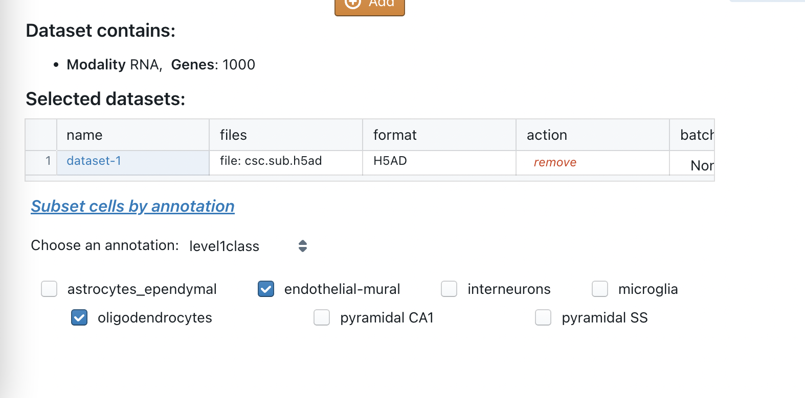
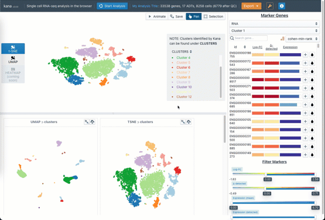
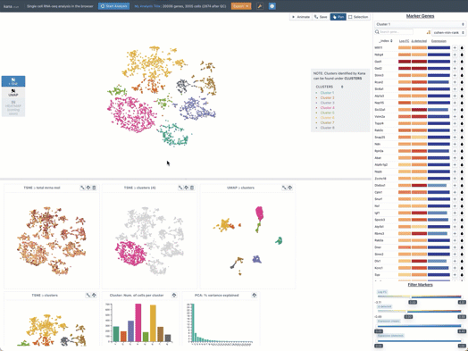
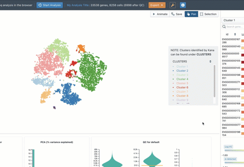

# Changelog

## V2.2.0
- Perform analysis on a subset of cells

## V2.0.0
- Support for a multi-modal analysis of ADT + RNA
- Added new parameter elements for ADT, integrated analysis
- Support multiple modalities in the marker selection
- Support multiple modalities in diagnostic plots

## V1.2.0

- Visually compare embeddings across annotations
- with linked embeddings, you can now make lasso selections on any plot and the app automatically highlights these cells across all visualizations
- save and restore state of the embedding from the gallery
- export plots from the interface as png
- drag and drop, and reorganize the gallery in any order you like

## V1.1.0

- Support ADTs 
To overlay normalized protein expression of a marker for any ADT tag, these are available as column annotations

## V1.0.0

- Full release of the application. 
- Supports everything in [README](./README.md)