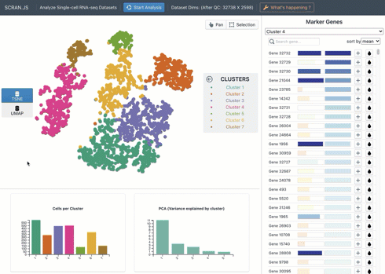
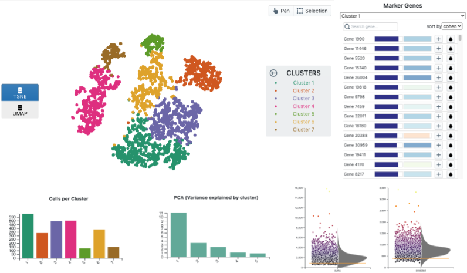
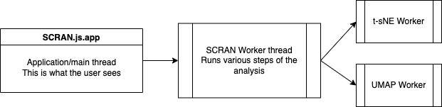

# Single cell RNA-seq analysis in the browser

## Overview

**kana** is a web application for single-cell RNA-seq data analysis that works directly in the browser.
That's right - the calculations are performed client-side, by your browser, on your computer!
This differs from the usual paradigm of, e.g., Shiny applications where data needs to be sent to a backend server that does the actual analysis.
Our client-side approach has a number of advantages:

- Your data is never transferred anywhere, so you don't have have to worry about problems with data privacy.
  These can be especially hairy when your backend server lies in a different jurisdiction from your data source.
  By performing the analysis on the client, we avoid all of these issues.
- **kana** is super-cheap to run and deploy, just serve it as a static website.
  There's no need to maintain a server or cloud compute instance - let the user's machine take care of it.
  It also naturally scales to any number of users as they're automatically providing the compute.
- By removing network latency, we can achieve a smooth interactive experience.
  This ranges from steps such as animated dimensionality reductions to user-driven marker detection.



## For users

If you have a Matrix Market (`.mtx`) file, you're ready to go.

1. Launch the application by clicking [**here**](https://www.jkanche.com/scran.js.app).
2. Select the Matrix Market file (this may be Gzip-compressed).
   We recommend also providing the corresponding `genes.tsv` or `features.tsv` file to identify marker genes properly.
3. Click the "Analyze" button, and we'll run a standard scRNA-seq analysis for you.

The standard analysis follows the flow described in the [**Orchestrating Single-Cell Analysis with Bioconductor**](https://bioconductor.org/books/release/OSCA/).
Briefly, this involves:

- Removal of low-quality cells 
- Normalization and log-transformation
- Modelling of the mean-variance trend across genes
- A principal components analysis on the highly variable genes
- Clustering with graph-based methods
- The usual dimensionality reductions (t-SNE/UMAP)
- Marker detection for each cluster

The interface provides a depiction of the dimensionality reduction of choice,
a ranking of marker genes for the cluster of interest,
and diagnostic plots from the individual analysis steps.



**Tips and tricks:**

- Clicking on a cluster name in the legend will highlight that cluster in the t-SNE/UMAP plot.
- Clicking on the droplet icon in the marker table will color the t-SNE/UMAP plot by the expression of the selected gene.
- Clicking on the plus icon in the marker table will give some details about that gene's expression in the selected cluster, including a histogram relative to cells in other clusters.
- Clicking on "What's happening" will show logs describing how long each step of the analysis took (and any errors during the analysis).

## For developers

### Deployment 

Deployment is as easy as serving the static files in this repository via HTTPS.
Indeed, our [**deployment**](https://www.jkanche.com/scran.js.app) is just being served via GitHub Pages.
As promised, there's no need to set up a backend server.

### Architecture

**kana** uses the [**scran.js**](https://github.com/jkanche/scran.js) library for efficient client-side execution of scRNA-seq analysis steps.
This uses a variety of C/C++ libraries compiled to [WebAssembly](https://webassembly.org/) to enable heavy-duty calculations in the browser at near-native speed.

<!--
Traditional data analysis applications use ***function shipping***, where a client (or an application in the browser) wants to perform an operation on a dataset on a backend server.
The client makes an API call to the server asking it to compute a function, the server responds with the results of the operation and the client/app displays them. 
In **kana**, we replace the server with the users's own laptop/machine. 
-->

All computations performed by **kana** run in a [Web Worker](https://developer.mozilla.org/en-US/docs/Web/API/Web_Workers_API/Using_web_workers).
This avoids blocking on the main thread and allows the application to be more responsive.
Data is sent to the main thread on an as-needed basis, e.g., for visualizations. 
We also create separate Web Workers for the t-SNE and UMAP steps so that they can be run concurrently for maximum efficiency.



The Wasm code itself is compiled with PThreads support to enable parallelization of some analysis steps.
This involves the use of a [`SharedArrayBuffer`](https://developer.mozilla.org/en-US/docs/Web/JavaScript/Reference/Global_Objects/SharedArrayBuffer) to efficiently share memory across Web Workers,
which in turn requires cross origin isolation of the site.
We achieve this by using a service worker to cache the resources and load the blobs with the relevant headers - hence the need for HTTPS.

### Contributing

Install dependencies:

```
npm install or yarn # depending on what you use
```

To start the app:

```
yarn start # if using yarn, highly recommended
npm run start # if using npm
```

This usually runs on port 3000 unless something else is already running on the same port.

Developers can pull down the latest **scran.js** files by entering `public/scran` and running `transplant.sh`.

For the curious: this project was bootstrapped with the [Create React App](https://github.com/facebook/create-react-app).
