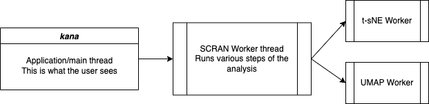

# Kana: Single cell analysis in the browser

*Kana* comes from the [Telugu](https://en.wikipedia.org/wiki/Telugu_language) word [kaṇaṁ (కణం)](https://www.shabdkosh.com/dictionary/english-telugu/%E0%B0%95%E0%B0%A3%E0%B0%82/%E0%B0%95%E0%B0%A3%E0%B0%82-meaning-in-telugu), which means ...  drumroll... ***cell***

## Overview

[Checkout our preprint on bioRxiv](https://www.biorxiv.org/content/10.1101/2022.03.02.482701v1)

**kana** is a web application for single-cell data analysis that works directly in the browser.
That's right - the calculations are performed client-side, by your browser, on your computer!
This differs from the usual paradigm of, e.g., Shiny applications where data needs to be sent to a backend server that does the actual analysis.
Our client-side approach has a number of advantages:

- Your data is never transferred anywhere, so you don't have to worry about problems with data privacy.
  These can be especially hairy when your backend server lies in a different jurisdiction from your data source.
  By performing the analysis on the client, we avoid all of these issues.
- **kana** is super-cheap to run and deploy, just serve it as a static website.
  There's no need to maintain a server or cloud compute instance - let the user's machine take care of it.
  It also naturally scales to any number of users as they're automatically providing the compute.
- By removing network latency, we can achieve a smooth interactive experience.
  This ranges from steps such as animated dimensionality reductions to user-driven marker detection and celltype annotation.


## For users

If you have a Matrix Market (`.mtx`) file or HDF5 (tenx V3 or `AnnData` representation stored as h5ad), or `SummarizedExperiment` (or derivatives like `SingleCellExperiment`) stored as an RDS file, or an [ExperimentHub](https://bioconductor.org/packages/release/bioc/html/ExperimentHub.html) id, you're ready to go.

1. Launch the application by clicking [**here**](https://www.kanaverse.org/kana/).
2. Select the Matrix Market file (this may be Gzip-compressed).
   We recommend also providing the corresponding `genes.tsv` or `features.tsv` file to identify marker genes properly.
3. Click the "Analyze" button, and we'll run a standard single-cell analysis for you.

The standard analysis follows the flow described in the [**Orchestrating Single-Cell Analysis with Bioconductor**](https://bioconductor.org/books/release/OSCA/).
Briefly, this involves:

- Removal of low-quality cells 
- Normalization and log-transformation
- Modeling of the mean-variance trend across genes
- A principal components analysis on the highly variable genes
- Clustering with graph-based methods
- The usual dimensionality reductions (t-SNE/UMAP)
- Marker detection for each cluster
- Compute gene set enrichment for each cluster
- Support Multi-modal analysis for Cite-seq data and/or CRISPR
- Make custom cell selections and detect markers for this selection
- Cell type annotation for each cluster across user selected reference datasets
- Perform Integration or Batch correction using MNN correction. You can provide a single dataset containing multiple batches and specify the `batch` column in the cell annotations, or load multiple datasets where each dataset is considered a batch
- Perform analysis on subsets (filter based on cell annotation)

The interface provides a depiction of the dimensionality reduction of choice,
a ranking of marker genes for the cluster of interest,
and diagnostic plots from the individual analysis steps.


**Tips and tricks:**

- Clicking on a cluster name in the legend will highlight that cluster in the t-SNE/UMAP plot.
- Clicking on the droplet icon in the marker table will color the t-SNE/UMAP plot by the expression of the selected gene.
- Clicking on the plus icon in the marker table will give some details about that gene's expression in the selected cluster, including a histogram relative to cells in other clusters.
- Hovering over the bars in the Markers section for a gene displays a tooltip on different statistics for that gene vs the selected cluster.
- Filter markers either by searching for a gene or using the sliders to filter by various statistics.
- Clicking on Save in the t-SNE or UMAP section will capture the current state of the visualization to Gallery
- Clicking on Animate will interactively visualize dimensions at various iterations as the t-SNE or UMAP algorithms computes these embeddings
- Clicking on "What's happening" will show logs describing how long each step of the analysis took (and any errors during the analysis).
- Clicking Export will save the analysis either to the browser or download the analysis as a .kana file. Loading these files will restore the state of the application

## For developers

### Deployment 

Deployment is as easy as serving the static files in this repository via HTTPS.
Indeed, our [**deployment**](https://kanaverse.org/kana/) is just being served via GitHub Pages. other providers include static hosting on AWS S3, Google buckets, netlify or *name-your-own-provider*.
As promised, there's no need to set up a backend server.

#### Docker based builds

Thanks to [llewelld](https://github.com/llewelld) for creating a docker image that can generate static HTML files without the hassle of setting up `npm` and `node`.

Build the docker images and tag them as ***kana***. 

```sh
docker build . -t kana

# if you are on a macos with m1 or m2, you MIGHT have to use the platform tag
docker build . -t kana --platform linux/arm64
```

Run the container to generate the production builds,

```sh
docker run -v .:/kana -t kana

# or depending on your operating system (noticed this on windows with WSL)
docker run -v $(pwd):/kana -t kana 
```

and voila, you should now see a builds directory. you can also run the npm commands to generate the builds. checkout either the [Dockerfile](./Dockerfile) or the [contributing section](#contributing) in this README.


### Architecture

***We have significantly revamped the entire application and the underlying infrastructure to support hybrid compute - either purely client-side with webassembly, or on backend systems through node, or both.***

**kana** uses the [**scran.js**](https://github.com/kanaverse/scran.js) library for efficient client-side execution of single-cell analysis steps.
This uses a variety of C/C++ libraries compiled to [WebAssembly](https://webassembly.org/) to enable heavy-duty calculations in the browser at near-native speed.

<!--
Traditional data analysis applications use ***function shipping***, where a client (or an application in the browser) wants to perform an operation on a dataset on a backend server.
The client makes an API call to the server asking it to compute a function, the server responds with the results of the operation and the client/app displays them. 
In **kana**, we replace the server with the users's own laptop/machine. 
-->

All computations performed by **kana** run in a [Web Worker](https://developer.mozilla.org/en-US/docs/Web/API/Web_Workers_API/Using_web_workers).
This avoids blocking on the main thread and allows the application to be more responsive.
Data is sent to the main thread on an as-needed basis, e.g., for visualizations. 
We also create separate Web Workers for the t-SNE and UMAP steps so that they can be run concurrently for maximum efficiency.



The WASM code itself is compiled with PThreads support to enable parallelization of some analysis steps.
This involves the use of a [`SharedArrayBuffer`](https://developer.mozilla.org/en-US/docs/Web/JavaScript/Reference/Global_Objects/SharedArrayBuffer) to efficiently share memory across Web Workers,
which in turn requires cross origin isolation of the site.
We achieve this by using a service worker to cache the resources and load the blobs with the relevant headers - hence the need for HTTPS.

### Friends of Kana

 
- [ba***kana***](https://github.com/kanaverse/bakana): The core analysis workflow is refactored into an independent package to provide the same functionality in browser and node environments. The Kana front-end is now a wrapper around bakana.
- [***kana***pi](https://github.com/kaanverse/kanapi): provides a node API (using WebSockets) to run single-cell analysis in backend environments (extending `bakana`). One can extend **Kana** to interact to this API (#good-first-issue)
- [***kana***-formats](https://github.com/kanaverse/kana-formats): as we add new functionality and features, we need to store and read the exported analysis state (`.kana` files). This package specifies the formats and provides readers for parsing various versions.
- [***kana***val](https://github.com/kanaverse/kanaval): validate the exported analysis results. 


### Contributing

Install dependencies:

```sh
npm install --force or yarn # depending on what you use
npm dedupe --force # you might sometimes have to dedupe
```

To start the app:

```sh
yarn start # if using yarn, highly recommended
npm run start # if using npm
```

This usually runs on port 3000 unless something else is already running on the same port.

For the curious: this project was bootstrapped with the [Create React App](https://github.com/facebook/create-react-app).
